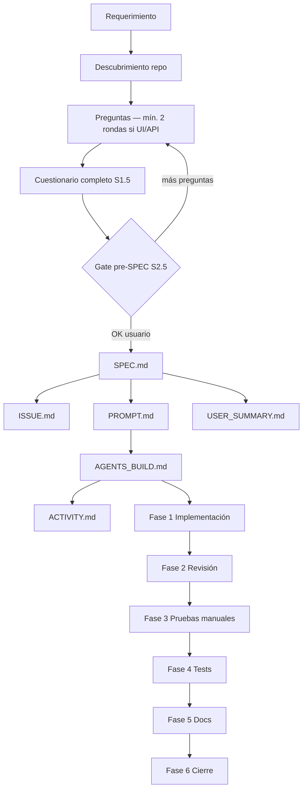

# Feature Workflow — Fuente canónica

Flujo lógico compartido por Cursor y OpenCode. Los adaptadores (`SKILL.md`) solo
añaden metadatos de descubrimiento; el comportamiento vive aquí.

---

## Principios

1. **Portabilidad:** no asumir stack, rutas ni herramientas de un proyecto concreto.
2. **Descubrimiento primero:** leer lo que exista en el repo antes de actuar.
3. **Una HU por defecto:** varias solo con motivo documentado y confirmación.
4. **Gates humanos:** STOP entre fases salvo instrucción contraria del usuario.
5. **Decisiones en SPEC:** los documentos hijos no repiten decisiones de negocio.
6. **Sin tests prematuros:** tests automatizados solo en Fase 4 tras OK en 2 y 3.
7. **Reutilizar antes de inventar:** buscar patrones y pantallas análogas en el repo;
   alinear diseño y capas; desviar solo con decisión documentada o OK del usuario.

---

## Artefactos

### Temporales (durante la feature)

| Archivo | Rol |
|---------|-----|
| `SPEC.md` | Raíz: requerimiento, proceso, decisiones, HU, criterios, escenarios |
| `PROMPT.md` | Prompt para sesión de implementación |
| `AGENTS_BUILD.md` | Traza técnica, pasos, incidentes, pruebas Fase 3 |
| `USER_SUMMARY.md` | Resumen y explicaciones para el usuario |
| `ACTIVITY.md` | Horas inicio/fin y actividades por sesión |

### Permanentes (sobreviven al cierre)

| Artefacto | Dónde |
|-----------|-------|
| Issue | `ISSUE.md` (si el usuario conserva el WIP o lo promociona) |
| Código y config | Cambios en el repo |
| Documentación de producto | Solo si Fase 5 lo exige |
| Registro de actividades | `ACTIVITY.md` solo si el usuario elige conservarlo |

La skill **no borra** archivos sola. La **Fase 6** pregunta qué conservar o borrar.

---

## Modo Especificación (`spec`)

### Entrada

Requerimiento del usuario (vago o detallado).

### Pasos

#### S0 — Descubrimiento

Ejecutar [reference/discovery-checklist.md](reference/discovery-checklist.md) y
[reference/reuse-patterns-checklist.md](reference/reuse-patterns-checklist.md).

Buscar **features análogas** (mismo menú/rol, listados, buscadores, modales,
paginación, capas front/back) **antes** de la primera ronda de preguntas.

Anotar en `SPEC.md` (sección «Convenciones del proyecto» y «Patrones existentes»)
o en borrador interno antes de crear archivos:

- Comandos lint, format, test, build
- Estructura de carpetas y capas
- Política de commits y tests
- Documentación existente y su estilo
- Gestor de tareas (si existe); si no, Issue en Markdown
- **Patrones a reutilizar** (archivos referencia por área: UI, API, capas)

#### S1 — Aclaración del requerimiento

- Formular preguntas con opciones concretas cuando sea posible (`AskQuestion`).
- **Tantas rondas como hagan falta** hasta cerrar ambigüedades críticas.
- Revisar código o docs relevantes del repo para anclar preguntas a la realidad,
  no a suposiciones genéricas.
- En ronda UX, **mostrar al usuario** patrones ya existentes («en X ya se hace así;
  ¿replicamos?») — ver `reuse-patterns-checklist.md`.
- Seguir las rondas temáticas de
  [reference/spec-questionnaire.md](reference/spec-questionnaire.md).
- **Mínimo dos rondas** si la feature tiene UI, listados, búsqueda, formularios,
  permisos o API nueva.
- **Prohibido** crear archivos en `docs/_wip/` tras una sola ronda salvo que el
  usuario confirme que el requerimiento ya es exhaustivo.

#### S1.5 — Completitud del cuestionario

Antes de historias de usuario o SPEC:

1. Recorrer las categorías obligatorias en `spec-questionnaire.md` (A–G).
2. Marcar cada ítem: **Cerrada**, **N/A** o **Diferida** (esta última solo con OK
   explícito del usuario).
3. Si faltan categorías obligatorias aplicables → **otra ronda de preguntas** (volver a S1).
4. No asumir decisión por mención vaga en el prompt («paginación», «buscador»,
   «modal» no cierran UX ni comportamiento).

#### S2 — Historias de usuario

- El agente **propone 1 vs N** historias con justificación.
- Usuario confirma.
- Por defecto: **una HU** que cubra el valor completo del requerimiento.
- Varias HUs solo si hay persona distinta, entrega independiente con valor propio,
  otro canal o alcance explícitamente excluido de este epic.
- Las subtareas técnicas (front, API, tests) **no son HUs**.

#### S2.5 — Gate pre-SPEC (obligatorio)

**STOP.** No crear `docs/_wip/` ni ningún artefacto hasta:

1. Presentar en el chat la tabla **Cobertura del cuestionario** (plantilla en
   `spec-questionnaire.md`).
2. Incluir resumen de decisiones tomadas y huecos conscientes (incl. diferidas).
3. Recibir **OK explícito** del usuario para generar SPEC y derivados.

Si el usuario pide cambios, volver a S1/S1.5.

#### S3 — Redactar SPEC.md

Usar [templates/SPEC.md](templates/SPEC.md). Debe incluir como mínimo:

- Estado y metadatos
- Cómo se construyó la especificación (proceso, rondas, tablas pregunta→decisión)
- Cobertura del cuestionario (tabla ID / estado / decisión)
- Requerimiento inicial literal
- Resumen ejecutivo
- Contexto del comportamiento actual (si aplica)
- Determinación 1 vs N HU
- Historia de usuario definitiva (narrativa, alcance, DoD, subtareas)
- Decisiones de producto (tabla consolidada)
- Criterios de aceptación y escenarios GWT
- Notas técnicas y riesgos
- **Patrones existentes en el repo** y desvíos acordados (si los hay)
- Referencias orientativas al código (estado previo)
- Historial del documento

Opcional en SPEC: ID interno (`HU-XXX`) — **nunca** en el título de la Issue.

#### S4 — Derivar ISSUE.md

Usar [templates/ISSUE.md](templates/ISSUE.md). Complementa SPEC sin duplicar
el proceso ni las decisiones extensas.

**Formato obligatorio de la Issue:**

```markdown
# {NOMBRE DESARROLLADOR} - {Título descriptivo}
### 📌 Descripción
### 🎯 Objetivos
### ✅ Criterios de aceptación
### 🛠️ Consideraciones técnicas
### 🧪 QA / Pruebas
### 📎 Notas adicionales
```

- **Título:** `{NOMBRE DESARROLLADOR} - {Título}` — descriptivo, sin códigos HU.
  Preguntar nombre del desarrollador; si no se conoce, usar `Por asignar`.
- **Descripción:** tres viñetas (problema/necesidad, impacto usuario o sistema,
  razón del cambio).
- **Criterios:** checkboxes observables y verificables.
- Metadatos WIP (slug, enlace SPEC, estado) solo en bloque al inicio del archivo
  local; **excluirlos** al exportar la Issue al gestor.

**Al entregar la Issue en el chat** (copiar al gestor):

- Devolver **solo** la Issue completa.
- Contenida **entera** en un **único** bloque de código Markdown.
- Sin instrucciones del agente ni metadatos WIP.

#### S5 — Derivar PROMPT.md

Usar [templates/PROMPT.md](templates/PROMPT.md). Prompt **autocontenido** para
una sesión de implementación nueva. Debe permitir implementar sin releer todo SPEC,
pero puede referenciar rutas WIP relativas.

Incluir: tarea, flujo de fases, alcance, fuera de alcance, arquitectura descubierta,
archivos orientativos, entregables por fase, git.

#### S6 — Iniciar USER_SUMMARY.md

Usar [templates/USER_SUMMARY.md](templates/USER_SUMMARY.md):

- Estado: especificación cerrada / implementación pendiente
- Resumen en lenguaje claro
- Próximo paso: invocar `feature-workflow implement` con el slug

#### S7 — Gate de cierre de especificación

**STOP.** Esperar OK explícito del usuario antes de implementar.

---

## Modo Implementación (`implement`)

### Entrada

- Slug WIP (`docs/_wip/{feature-slug}/`), o
- Ruta al directorio WIP, o
- Petición de implementar con contexto suficiente para localizar el WIP.

Si no existe `PROMPT.md`, detenerse y pedir completar especificación primero.

### Pasos

#### I0 — Preparar AGENTS_BUILD.md

Crear o continuar desde [templates/AGENTS_BUILD.md](templates/AGENTS_BUILD.md).

**Autocontenido:** copiar snapshot mínimo de SPEC:

- Historia de usuario (narrativa + incluye / no incluye)
- Tabla resumen de decisiones
- Criterios de aceptación
- Escenarios GWT

No depender de leer SPEC en cada turno. Registrar convenciones del proyecto
(descubrimiento) en § Instrucciones de trabajo.

#### I1 — Iniciar o continuar ACTIVITY.md

Usar [templates/ACTIVITY.md](templates/ACTIVITY.md).

- Al **abrir sesión:** fecha + hora de **Inicio** (formato `8:00 am`).
- Al **cerrar sesión** o en Fase 6: hora de **Fin** + lista **Actividades** en
  **primera persona** (como si las escribiera el usuario: «Elaboré…», «Programé…»,
  «Probé…»). No voz del agente ni encabezados técnicos tipo «Implementación API:».
- Una sesión = un bloque con `#### **Fecha:**` / `##### **Inicio:**` /
  `##### **Fin:**` y viñetas bajo `**Actividades**`.
- Sesiones pasadas se conservan debajo; no usar tabla resumen.

#### I2 — Fases 1–6

Seguir [reference/phase-gates.md](reference/phase-gates.md).

| Fase | Nombre | Gate |
|------|--------|------|
| 1 | Implementación | STOP → Fase 2 |
| 2 | Revisión | STOP → Fase 3 |
| 3 | Pruebas manuales | STOP → Fase 4 (o 5 si no hay tests) |
| 4 | Tests automatizados | Solo si el proyecto los usa |
| 5 | Documentación | Evaluar necesidad real |
| 6 | Cierre y limpieza | Commit opcional; preguntar qué conservar del WIP |

#### I3 — USER_SUMMARY durante implementación

Actualizar en:

- **Fase 2 (iterativa):**
  - entrega inicial: narrativa por capas + tabla «Ruta de cambios por archivo»;
  - **cada ajuste** del usuario: nueva fila en «Iteraciones Fase 2», actualizar
    tablas y comportamiento visible;
  - tras **cada** ajuste, preguntar: ¿otro ajuste o continuar a Fase 3?
  - en chat: explicar cambios; tabla exhaustiva en el archivo (en chat si ≤ 8 archivos).
- **Fase 3:** resultado de pruebas manuales (OK/KO por ítem)
- **Cierre:** estado final y pendientes

#### I3b — AGENTS_BUILD durante iteraciones de Fase 2

Tras **cada** ajuste (no solo al final de Fase 2):

- §6 Pasos — añadir paso con el ajuste.
- §7 Archivos — actualizar.
- §9 Historial del chat — registrar petición y resolución.
- Mantener sincronía con `USER_SUMMARY.md`.

#### I4 — AGENTS_BUILD durante implementación (general)

Mantener **un solo listado de pasos** (tabla con estado). Añadir:

- Archivos modificados
- Historial del chat (cronológico)
- Incidentes / diagnósticos profundos (sección opcional)
- Pruebas manuales propuestas (Fase 3)
- Riesgos abiertos
- Historial de ediciones del archivo

#### I5 — Fase 6 — Cierre

1. Verificar DoD (criterios, checklist, pruebas, tests si aplica).
2. Ofrecer mensaje de commit en español (`tipo(scope): descripción`) + comandos.
3. **No ejecutar git** sin petición explícita.
4. Preguntar qué archivos o carpetas de `docs/_wip/{slug}/` conservar o borrar.
5. Si el usuario elige borrar, eliminar solo lo acordado.

---

## Variantes de contexto

No hay atajos como skills separadas. El comportamiento se adapta en cada paso:

| Contexto | Ajuste |
|----------|--------|
| Solo documentación | Fase 1 sin código; Fase 4 omitida si no hay tests de docs |
| Hotfix | Spec mínima previa o SPEC abreviado; Fases 2–3 obligatorias |
| Solo infra/config | SPEC con foco técnico; pruebas manuales de despliegue/verificación |
| Sin tests en el repo | Omitir Fase 4; anotar en ISSUE y AGENTS_BUILD |

---

## Trazabilidad



---

## Historial

| Fecha | Evento |
|-------|--------|
| 2026-06-18 | Creación inicial del workflow |
