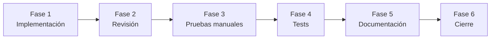
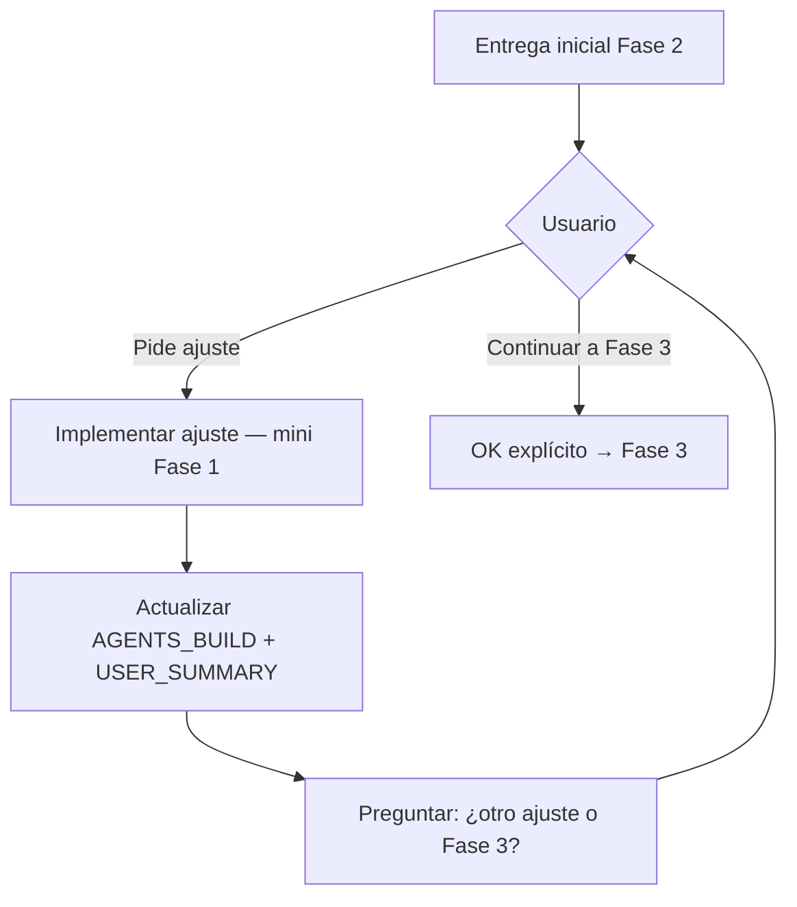

# Fases de implementación (gates)

Referencia detallada para el modo `implement`. Resumen en `PROMPT.md`.

**Regla global:** al final de cada fase, **STOP** hasta confirmación explícita
del usuario, salvo que indique lo contrario.

---

## Fase 1 — Implementación (sin tests automatizados)

**Objetivo:** código funcional según criterios de aceptación, **alineado con patrones
existentes** del repo.

- [ ] Leer `PROMPT.md`, `ISSUE.md` y `AGENTS_BUILD.md`.
- [ ] Releer **patrones referencia** del SPEC y [reuse-patterns-checklist.md](reuse-patterns-checklist.md).
- [ ] Antes de crear componentes/servicios nuevos: confirmar que no existe equivalente
  reutilizable (`DataTable`, modales, paginación API, esqueleto de capas).
- [ ] Si el código diverge del patrón existente sin estar en SPEC: **detener** y
  consultar al usuario (refactorizar hacia patrón vs desvío documentado).
- [ ] Aplicar descubrimiento del repo (ver `discovery-checklist.md`).
- [ ] Spikes o verificaciones pendientes de la spec (API, datos, permisos).
- [ ] Implementar cambios en las capas que correspondan.
- [ ] Ejecutar lint/format descubiertos en el proyecto.
- [ ] **No crear ni modificar** tests automatizados.
- [ ] Actualizar §6 Pasos y §7 Archivos en `AGENTS_BUILD.md`.
- [ ] Registrar inicio de sesión en `ACTIVITY.md` (fecha + **Inicio**; ver plantilla).
- [ ] **Parar** → Fase 2.

---

## Fase 2 — Revisión por el usuario

**Objetivo:** el usuario valida enfoque y cambios antes de pruebas formales, con
**justificación de cada archivo** sin tener que leer el diff.

Fase 2 es **iterativa**: es habitual que el usuario pida uno o varios ajustes antes
de aprobar. El agente debe mantener `AGENTS_BUILD.md` y `USER_SUMMARY.md`
**siempre al día** tras cada cambio.

### Entrega inicial (primera pasada Fase 2)

Actualizar `USER_SUMMARY.md` — sección «Revisión de cambios (Fase 2)»:

1. **Qué problema resuelve** — 1–2 frases.
2. **Qué cambió para el usuario** — comportamiento visible.
3. **Ruta de cambios por capa** — recorrido narrativo (API → dominio → UI…).
4. **Ruta de cambios por archivo (obligatorio)** — tabla con **una fila por
   archivo** creado o modificado: `Archivo | Capa/área | Por qué se tocó`.
   - Explicar el **motivo**, no el código ni el diff.
   - **Sin omisiones:** contrastar con el diff o `AGENTS_BUILD.md` §7.
5. **Qué se eliminó** — comportamiento o UI legacy.
6. **Riesgos o limitaciones** — casos límite conocidos.
7. **Consistencia con la app** — qué patrones existentes se siguieron; desvíos
   deliberados y motivo (si el diseño no replica otra pantalla similar).

Actualizar en paralelo `AGENTS_BUILD.md`:

- §6 Pasos — marcar entrega Fase 2.
- §7 Archivos modificados — lista completa.
- §9 Historial del chat — entrada de la entrega.

**En el chat** (además de actualizar los archivos):

- Narrar la ruta por capas en lenguaje sencillo.
- Si ≤ 8 archivos: puede incluir la tabla completa en el mensaje.
- Si > 8 archivos: recorrer cada capa citando archivos clave y remitir a la
  tabla exhaustiva en `USER_SUMMARY.md`.
- **Prohibido** cerrar Fase 2 solo con bullets genéricos («se tocó API y App»).
- **Preguntar:** «¿Apruebas para pasar a pruebas manuales (Fase 3) o quieres algún ajuste?»

### Bucle de ajustes (cada iteración)

Cuando el usuario **pide un ajuste** (UI, comportamiento, copy, bug, etc.):

1. **Implementar** el cambio (alcance mínimo del ajuste; lint/format).
2. **Actualizar `AGENTS_BUILD.md`:**
   - §6 — nuevo paso numerado con el ajuste (marcado hecho).
   - §7 — archivos tocados en esta iteración (añadir o actualizar filas).
   - §9 — línea en historial del chat (qué pidió el usuario, qué se hizo).
   - §10 Incidentes — si el ajuste fue corrección de bug.
3. **Actualizar `USER_SUMMARY.md`:**
   - Sección **«Iteraciones Fase 2»** — nueva fila: fecha, petición, qué cambió
     para el usuario, archivos afectados.
   - Actualizar tabla **«Ruta de cambios por archivo»** si hay archivos nuevos
     o motivos distintos.
   - Actualizar «Qué cambió para el usuario» si el comportamiento visible cambió.
4. **En el chat:** resumir el ajuste en lenguaje claro (sin asumir que el usuario
   leyó el diff).
5. **STOP — pregunta obligatoria** (usar `AskQuestion` si existe):

   > ¿Quieres **otro ajuste** en esta revisión o **continuamos a Fase 3** (pruebas manuales)?

   Opciones típicas: «Otro ajuste» / «Continuar a Fase 3».

6. Si **otro ajuste** → volver al paso 1 del bucle.
7. Si **continuar a Fase 3** → registrar aprobación en `USER_SUMMARY` (checkbox
   Fase 2) y `AGENTS_BUILD` §6; pasar a Fase 3.
8. **No avanzar a Fase 3** sin respuesta explícita del usuario a la pregunta del
   paso 5 (ni asumir OK por silencio).

### Cierre de Fase 2

- [ ] Tabla «Por qué se tocó» completa y actualizada tras **todas** las iteraciones.
- [ ] `AGENTS_BUILD.md` refleja cada ajuste en pasos e historial.
- [ ] `USER_SUMMARY.md` — sección «Iteraciones Fase 2» con cada vuelta.
- [ ] Usuario respondió explícitamente **continuar a Fase 3** (no solo «se ve bien»
  sin cerrar el bucle si aún no se preguntó).
- [ ] Marcar aprobación Fase 2 en ambos documentos.
- [ ] **Parar** → Fase 3.

---

## Fase 3 — Pruebas manuales (usuario)

**Objetivo:** validar en entorno real.

El agente completa §11 en `AGENTS_BUILD.md` — checklist numerada:

1. **Qué preparar** (datos, usuario, configuración).
2. **Qué hacer** (pasos).
3. **Qué deberías ver** (resultado esperado).

Basarse en escenarios GWT del build y QA de `ISSUE.md`. Incluir al menos:

- Un caso feliz
- Un caso límite plausible
- Un caso de regresión plausible

- [ ] Agente entrega la tabla de pruebas.
- [ ] Usuario ejecuta y marca OK/KO (en build o summary).
- [ ] Actualizar `USER_SUMMARY.md` — sección Pruebas manuales.
- [ ] Si hay incidencias: diagnosticar (§10 Incidentes), corregir, repetir Fases 1–2 si hace falta.
- [ ] **Parar** hasta confirmación explícita → Fase 4 o 5.

---

## Fase 4 — Tests automatizados

**Objetivo:** fijar comportamiento con tests **solo** tras OK en Fases 2 y 3.

### Si el proyecto tiene tests

- [ ] Identificar rutas y patrones existentes en el repo.
- [ ] Actualizar o crear tests en las áreas afectadas.
- [ ] Ejecutar comando de test descubierto (archivos afectados o suite).
- [ ] Corregir hasta verde.
- [ ] Informar al usuario en `USER_SUMMARY.md`.
- [ ] Pasar a Fase 5.

### Si el proyecto NO tiene tests

- [ ] Anotar en `ISSUE.md` y `AGENTS_BUILD.md`: «sin tests automatizados».
- [ ] **Omitir** esta fase.
- [ ] Pasar a Fase 5.

---

## Fase 5 — Documentación

**Objetivo:** alinear el repo con el estado final **solo si hace falta**.

- [ ] Evaluar qué documentación existe y qué estilo usa.
- [ ] Actualizar docs de producto/comportamiento si el cambio es visible externamente.
- [ ] **No** duplicar la Issue entera en el repo.
- [ ] **No** usar `SPEC.md` como doc permanente.
- [ ] Si no hay nada que documentar, registrar «sin cambios de docs» y continuar.

---

## Fase 6 — Cierre y limpieza

**Objetivo:** cerrar la feature con trazabilidad y decisión sobre el WIP.

- [ ] Verificar DoD en `AGENTS_BUILD.md` §12.
- [ ] Completar `USER_SUMMARY.md` — sección Cierre.
- [ ] Registrar **Fin** y lista **Actividades** del día en `ACTIVITY.md` (primera
  persona del usuario; ver plantilla).
- [ ] Ofrecer mensaje de commit en español + comandos `git`.
- [ ] **No ejecutar** `git add` / `git commit` sin petición explícita.
- [ ] Preguntar qué archivos o carpetas de `docs/_wip/{slug}/` conservar o borrar.
- [ ] Ejecutar limpieza **solo** según respuesta del usuario.

---

## Resumen de restricciones para el agente

| Permitido en Fase 1 | Prohibido hasta Fase 4 |
|---------------------|-------------------------|
| Código y config necesarios | Crear o modificar tests automatizados |
| Lint/format del proyecto | Cerrar con tests sin OK del usuario en Fases 2–3 |
| Explicación para Fase 2 | `git commit` sin petición explícita |

---

## Variantes de contexto

| Contexto | Ajuste en fases |
|----------|-----------------|
| Solo docs | Fase 1 = edición de markdown; Fase 4 omitida si no hay tests de docs |
| Hotfix | Spec previa mínima; Fases 2–3 obligatorias |
| Infra/config | Fase 3 = verificación de despliegue o comando |
| Sin tests en repo | Saltar Fase 4 |

El agente adapta el checklist en §6 Pasos de `AGENTS_BUILD.md`; no usa skills separadas.
