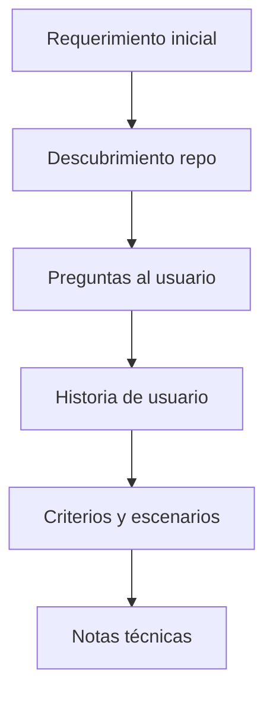

# {Título de la feature} — Historia de usuario y decisiones

Documento de registro del requerimiento, decisiones de producto y criterios de
aceptación acordados en conversación.

**Estado:** {borrador | especificación cerrada} · **implementación:** {pendiente | en curso | completada}

**Issues:** {1 HU → [ISSUE.md](ISSUE.md) · N>1 → ver índice abajo} · **Implementación:** [PROMPT.md](PROMPT.md)

---

## Convenciones del proyecto (descubrimiento)

| Tema | Valor descubierto |
|------|-------------------|
| Lint / format | |
| Tests | |
| Build | |
| Capas / arquitectura | |
| Commits | |
| Documentación existente | |
| Idioma de artefactos | español |
| Patrones referencia | {archivos modelo — ver reuse-patterns-checklist} |

---

## Patrones existentes en el repo

| Área | Referencia en código | Qué reutilizar |
|------|---------------------|----------------|
| {ej. paginación} | `{ruta/archivo}` | {descripción} |
| {ej. modal detalle} | `{ruta}` | {descripción} |

### Desvíos acordados (si el diseño difiere del patrón existente)

| Aspecto | Patrón en la app | Decisión en esta feature | Motivo / OK usuario |
|---------|------------------|--------------------------|---------------------|
| | | | |

---

## Cómo se construyó esta especificación

Documenta el **proceso** con el que se pasó del requerimiento a la historia cerrada.

### 1. Punto de partida: requerimiento inicial

> {Citar requerimiento literal del usuario}

Interpretaciones abiertas identificadas:

- {pregunta 1}
- {pregunta 2}

Revisión del código/docs actual antes de preguntar: {qué se leyó}.

### 2. Rondas de preguntas

#### Ronda 1 — {tema}

| Pregunta | Opciones ofrecidas | Resultado |
|----------|-------------------|-----------|
| | | |

#### Ronda N — {tema}

| Pregunta | Decisión |
|----------|----------|
| | |

### 3. Determinación de historias de usuario

{Justificación de 1 vs N HU — ver sección dedicada abajo}

### 4. Derivación de criterios y escenarios

{Cómo cada bloque de criterios y cada escenario GWT se traza a una decisión}

### 5. Diagrama del flujo de refinamiento



### 6. Qué quedó para implementación (no cerrado en spec)

- {decisión de UI diferida, spike, etc. — solo con OK explícito del usuario}

---

## Cobertura del cuestionario

Tabla obligatoria antes del gate pre-SPEC; copiar aquí la versión acordada con el usuario.

| ID | Estado | Decisión / N/A / Diferida |
|----|--------|---------------------------|
| A1 | Cerrada | |
| … | | |

Referencia: categorías en `spec-questionnaire.md` del paquete skill.

---

## Resumen ejecutivo

{Un párrafo: qué cambia, para quién, por qué.}

---

## Contexto: comportamiento actual

{Solo si aplica. Describir el estado previo al cambio.}

| Pieza | Ubicación / nota |
|-------|------------------|
| | |

### Cómo funciona hoy

1. {paso}
2. {paso}

---

## Determinación: una o varias historias de usuario

### Principio acordado

Priorizar **una sola HU** que cubra el valor completo. Varias solo con motivo
documentado (persona distinta, entrega independiente, otro canal, epic distinto).

### Criterios evaluados

| Criterio | Pregunta | Resultado |
|----------|----------|-----------|
| Persona | ¿Mismo rol? | |
| Objetivo | ¿Mismo «para qué»? | |
| Momento | ¿Mismo flujo/pantalla? | |
| Entrega | ¿Valor parcial sin el resto? | |
| Reglas | ¿Acopladas? | |

### Fragmentos analizados

| Fragmento | ¿HU separada? | Motivo |
|-----------|---------------|--------|
| | | |

### Decisión

| Resultado | Detalle |
|-----------|---------|
| **Historias** | {1 | N} |
| **Motivo** | |
| **Issues** | {1 → `ISSUE.md` \| N → `issues/HU-01.md` …} |

---

## Índice de Issues

Solo si **N > 1** HU. Si hay una sola HU, usar `ISSUE.md` en la raíz y omitir
esta sección.

| ID HU | Archivo Issue | Título (backlog) |
|-------|---------------|------------------|
| HU-01 | [issues/HU-01.md](issues/HU-01.md) | |
| HU-02 | [issues/HU-02.md](issues/HU-02.md) | |

---

## Historias de usuario

Repetir el bloque siguiente **por cada HU** acordada. Las decisiones transversales
del epic van en «Decisiones de producto» más abajo; cada HU lleva su alcance,
criterios y escenarios propios.

### HU-01 — {título backlog}

#### Identificación

| Campo | Valor |
|-------|--------|
| **ID interno** | HU-01 |
| **Título (backlog)** | {descriptivo} |
| **Issue** | [ISSUE.md](ISSUE.md) si N=1 · [issues/HU-01.md](issues/HU-01.md) si N>1 |
| **Persona** | |
| **Dependencias** | {otras HU, si aplica} |

#### Narrativa

**Como** {persona},  
**quiero** {acción},  
**para** {beneficio}.

#### Alcance de la HU

**Incluye:**

- {ítem}

**No incluye (fuera de esta HU):**

- {ítem}

#### Definición de hecho (DoD)

- [ ] Criterios de aceptación de esta HU cumplidos
- [ ] Escenarios GWT de esta HU verificados manualmente (fase 3)
- [ ] {criterio específico}

#### Subtareas técnicas (no son historias de usuario)

| ID | Subtarea | Capa |
|----|----------|------|
| T1 | | |

#### Criterios de aceptación (esta HU)

1. {criterio}

#### Escenarios GWT (esta HU)

##### Escenario 1 — {nombre}

- **Dado** {contexto}
- **Cuando** {acción}
- **Entonces** {resultado}

#### Copy / textos acordados

> {leyendas, mensajes, etc.}

---

### HU-02 — {título backlog}

{Repetir estructura de HU-01}

---

## Decisiones de producto (epic)

| # | Tema | Decisión | Notas |
|---|------|----------|-------|
| 1 | | | |

---

## Criterios transversales (epic, opcional)

Solo si aplica a **varias** HU a la vez. Los criterios de una sola HU van en su
bloque arriba, no aquí.

1. {criterio transversal}

---

## Fuera de alcance (epic)

## Notas técnicas

### Archivos a tocar (orientativo)

| Área | Archivos probables |
|------|-------------------|
| | |

### Riesgos y spikes

- {riesgo}: {acción en implementación}

### Cambios respecto al comportamiento actual

{Si aplica}

---

## Tareas sugeridas para implementación

1. {orden sugerido alineado con subtareas T1–Tn}

---

## Referencias en código (estado previo al cambio)

```text
{archivo} → {rol breve}
```

---

## Historial del documento

| Fecha | Evento |
|-------|--------|
| | Creación del documento |
